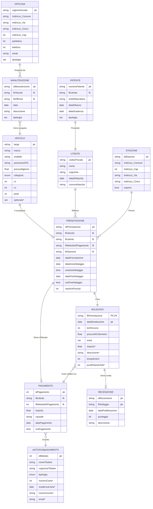

# Piattaforma di Car Sharing

## Introduzone al progetto

Si vuole creare un software per la gestione di un servizio di Car Sharing. Si deve realizzare uno schema ER dell’applicazione con il relativo schema logico con annessa spiegazione delle scelte progettuali. Una volta che la progettazione è completata è richiesta la creazione di uno Script SQL in cui si includono le seguenti parti:

* Creazione del DataBase
* Creazione di tutte le tabelle con relativi vincoli
* Popolazione del DataBase con dati di esempio (almeno 5 record per tabella)

Inoltre è anche richiesto di creare un dizionario dei dati al fine di descrivere le tabelle e i campi.
Infine sono richieste delle considerazioni finali sul progetto.

## Progettazione

### Analisi dei requisiti

La piattaforma deve gestire tutto il processo di un noleggio, che è costituito dai seguenti passaggi:

* Memorizzare i dati degli utenti e delle loro patenti.
* Registrare i dati dei veicoli.
* Registrare i luoghi in cui è possibile ritirare o restituire i veicoli, che possono essere stazioni o parcheggi.
* Si devono registrare le prenotazioni con data e ora di inizio del noleggio e datata e ora della riconsegna del veicolo.
* Si deve tenere traccia delle manutenzioni che vengono eseguite su un veicolo.
* In un noleggio possono essere effettuati dei danni sul veicolo o possono essere prese delle multe.
* Si deve anche gestire il sistema tariffario dei noleggi
* Inoltre si devono poter scrivere delle recensioni in merito ad un noleggio.
* Infine vanno inseriti dei vincoli: Un veicolo può essere noleggiato da un solo utente alla volta, calcolo automatico tariffe, stato veicolo (disponibile, in uso, in manutenzione).

### Diagramma Entità-Relazione (ER)

### Schema logico

Veicolo(<u>Targa</u>, marca, modello, latitudine, longitudine, prezzoAlGiorno, categoria, cc, cv, posti,optionals*)

Officina(<u>ragioneSociale</u>, indirizzo_Comune, indirizzo_Via, indirizzo_Civico, indirizzo_Cap,partitaIva, Telefono, email, tipologia)

Manutenzione(<u>idManutenzione</u>, fkVeicolo, fkOfficina, kmVeicolo, data, descrizione)

metodoDiPagamento(<u>idMetodo</u>, nomeTitolare, cognomeTitolare, Tipogia, numeroCarta*, scadenzaCarta*,numeroConto*,email*)

Stazione(<u>idStazione</u>, indirizzo_Comune,indirizzo_Cap, indirizzo_Via, indirizzo_Civico,  coperto )

Utente(<u>codiceFiscale</u>, nome, cognome, dataDiNascita, comuneDiNacita)

Pagamento(<u>idPagamento</u>, fkUtente, fkMetodoDiPagamento, importo, causale*,dataPagamento, oraPagamento)

Patente(<u>numeroPatente</u>, fkUtente, enteRilasciatore, dataRilascio, dataScadenza, tipologia)

Prenotazione(<u>idPrenotazione</u>, fkVeicolo, fkUtente, fkMetodoDIPagamento, fkStazione,dataPrenotazione, dataInizioNoleggio, oraInizioNoleggio, dataFineNoleggio, oraFineNoleggio, MaxkmPrevisti)

Noleggio(<u>fkPrenotazione</u>,<u>dataRestituzione</u>, kmPercorsi, extra, importoExtra*, tempoExtra*, puntiPatenteTolti*)

Recensione(<u>idRecensione</u>, <u>fkNoleggio</u>, dataPubblicazione, punteggio, descrizione)

### Dizionario dei dati

Descrizione di tabelle e campi:

#### Veicolo

La tabella veicolo contiene i dati di tutti i veicoli presenti sulla piattaforma. Pero ogni veicolo si tiene la targa per identificare univocamente un veicolo, la targa è una stringa di 6 caratteri. Inoltre risulta fondamentale alvarsi marca e modello per aiutaer gli utenti a scegliere un veicolo. Come in ogni piattaforma, per l'azienda che affitta i veicoli è fondamentale saper e in ogni momento dove si trovano i propri veicoli, e ciò viene fatto con i due attrubuti che indicano latitudine e longitudine. Inoltre per ogni veicolo si tiene conto del prezzo al giorno in modo da riuscire poi a calcolare il prezzo di ogni noleggio in base al numero di giorni del noleggio. Dopodichè i veicoli si distinguono con un attributo di tipo enum in autovetture e motocicli. Per ogni veicolo si tiene conto dei pparametri del motore quali cavalli e cilindrata e i posti omologati. Nel caso dei motocicli i posti omologati massimi sono 2 e nel caso delle autovetture il limite di 9 posti (limite imposto per legge a autevetture e autocarri) è imposto dalla lunghezza della variabile che prevede solo un numero intero da una cifra (da 0 a 9) limitata da un vincolo che lo vincola >0. Infine c'è un attributo di tipo set per includere gli optionals, esso è disponibile solo se il veicolo in questione è un'autovettura.

#### Officina

La tabella officina contiene i dati delle officine. Ogni officina è identificata univocamente dalla ragione sociale, è caratterizzata da suo indirizzo (Comune, cap, via, civico), dalla partita iva (numero intero da 11 caratteri), da un numero di telefono e un'email. Infine si vuole identificare il tipo di officina tramite un attributo di tipo set che indica i tipi di lavori che vengono svolti all'interno di essa, ad esempio lavori di carrozzeria, lavori di officina e lavori di elettrauto.

#### Manutenzione

La manutenzione di un veicolo dell'aziendda di car sharing è identificata da un numero intero, nell'sql l'ho messo auto_incerement tanto è progressivo. Per ogni manutenzione si tiene la targa del veicolo a cui è stata eseguita la manutenzione in quanto chiave primaria dell'entità veicolo. Inoltre c'è la chiave pprimaria dell'officina in cui è eseguita la manutenzione. Si tiene anche traccia dei chilometri del veicolo al momento della manutenzione (numero iuntero da 6 cifre in quanto è difficile che un'auto arrivi a più di 999.999 chilometri) e infine c'è  una breve descrizone dei lavori eseguiti.

#### Metodo di pagamento

Un metodo di pagamento descrive i dati di pagamento di una persona. Si ha un id del metodo di pagamento che è un numero intero da 6 caratteri, ogni metodo di pagamento di ogni persona ha un numero divero, anch'esso ha l'auto_increment in quanto è un numero progressivo. Poi ci sono il nome e il cognome del tiolare del metodo di pagamento e un attributo enum che indica i 3 tipi di pagamento disponibili quali bonifico, carta di credito e paypal. Nel caso del bonifico sarà necessario inseire il numero del proprio conto bancario, nel caso della  carta di credito bisogna inserire il numero della carta di credito e la sua data di scadenza, mentre nel caso di Paypal è necessario inserire l'email con cuisi è registrati alla piattaforma di pagamento. Questi ultimi dati sono limitati da un vincolo di tupla. Si potrebbe pensare di sostituir eil nome e cognome dell'intestatario con una fk all'entità utente descritta successivamente, ma fare ciò non conviene perchè un'utente che fa un aprenotazione potrebbe pagare con un conto o una carta di credito non intestato a se stesso.

#### Stazione

L'entità stazione indica un luogo in cui si ritirano e riconsegnao i vecoli. Per ogni stazione si ha un id della stazione, che consiste in una stringa composta dalla provincia in cui si trova e un numero intero di 3 cifre per identificare più stazioni all'interno della provincia. Ogni stazione è caratterizzata dal suo indirizzo (comune, cap, via, civico) e una variabile booleana che indica se la stazione è coperta o no.

#### Utente

L'entità utente ci identifica una persona che richiede di fare un noleggio. Ogni tente viene identificato univocamente dal codice fiscale e caratterizzato dal nome dal cognome, la data di nascita e il nome del comune di nascita.

#### Pagamento

Il pagamento indica un'operazione di pagamento seguendo un metodo di pagamento. Ogni pagamento è identificato univocamente da un id intero di 9 cifre con auto_increment in quanto è un numero progressivo. E' caratterizzato dal codice ficale dell'utente che esegue la prenotazione, e l'id del metodo di pagamento usato. Inoltre è caratterizzato dall'importo del pagamento, una causale e la data e ora in cui viene fatto il pagamento.

#### Patente

Ogni patente è identificata univocaemnte dal codice della patente che è una stringa di 10 caratteri, mentre è caratterizzata dal riferimento della persona a cui è intestata, dall'ente che l'ha rilasciata, dalla data di conseguimento e dalla data di scadenza. Inoltre c'è un attributo di tipo set per indicare quali tipi di patente ha conseguito l'utente.

#### Prenotazione

Una prenotazione tiene i dati di un noleggio al momento in cui un utente fa una richiesta a quando non riconsegna il veicolo. Una prenotazione è identificata univocamente da un codice alfanumerico di 7 caratteri ed è caratterizzato dalla targa del veicolo che è stato scelto, dal codice fiscale dell'utente che esegue la prenotazione, dall'id del metodo di pagamento ch everrà usato per saldare il noleggio e dall'id della stazione in cui verrà ritirato il veicolo. Inoltre per ogni prenotazione si tiene traccia della data della prenotazione, della data e dell'ora da cui è possibile ritirare il veicolo e dalla data e ora previste per la fine del noleggio. Per ogni prenotazione si impone anvche nun numero massimo di chilometri percorribli dall'utente, dopo lo sforamento di questa soglia si deve pagaer una penale.

#### Noleggio

L'entità noleggio tiene traccia di un noleggio il cui veicolo è già stato retituito, è identificato univocamente dalla prenotrazione a cui fa riferimento e dalla data di restituzione effettiva del veicolo per avere la coferma che il veicolo sia stato effettivamente restituito e valutare eventuali ritardi nella riconsegna di esso. Inoltre si salva asnche il nuemro di chilometrii percorsi dall'utenet con il veicolo noleggiato. Infine c'è un attributo di tipo set che indica gli extra quali  munte, danni, soramento data di restituzione o sforamento numero chilometri previsti per il noleggio. Infine ci sono 2 attributi nullable ceh vengono usati solo nel caso in cui ci sia uno sforamento di tempo (tempoExtra) espressa in ore arrotondando il tempo extra per eccessso e nel caso in cui ci sia una multa e dunque una perdita di punti dalla patente dell'utente (puntiPatenteTolti)

#### Recensione

In seguito ad aver fatto un noleggio l'utente può scrivere una recensione. Le recensioni sono identificate univocamente da un attributo intero con auto_increment essendo un numero progressivo, HA un riferimento diretto al noleggio effettuato per evitare eche alcune persone possano lasciaer una recensione senza aver neanche fatto un noleggio. Inoltre si tiene traccia della data di pubblicazione della recensione, di un punteggio (da 0 a 9) e una descrizione.

Vedi gestione extra e limite km