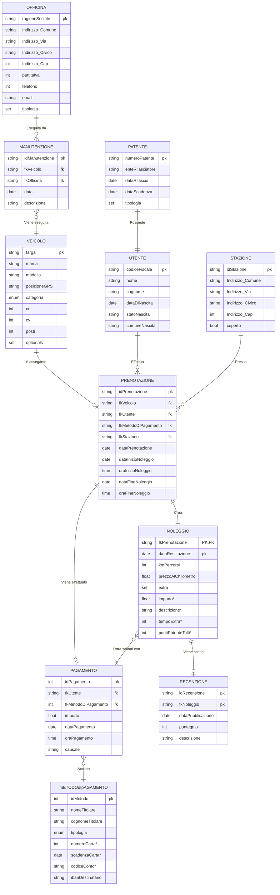

# Piattaforma di Car Sharing

## Introduzone al progetto

Si vuole creare un software per la gestione di un servizio di Car Sharing. Si deve realizzare uno schema ER dell’applicazione con il relativo schema logico con annessa spiegazione delle scelte progettuali. Una volta che la progettazione è completata è richiesta la creazione di uno Script SQL in cui si includono le seguenti parti:

* Creazione del DataBase
* Creazione di tutte le tabelle con relativi vincoli
* Popolazione del DataBase con dati di esempio (almeno 5 record per tabella)

Inoltre è anche richiesto di creare un dizionario dei dati al fine di descrivere le tabelle e i campi.
Infine sono richieste delle considerazioni finali sul progetto.

## Progettazione

### Analisi dei requisiti

La piattaforma deve gestire tutto il processo di un noleggio, che è costituito dai seguenti passaggi:

* Memorizzare i dati degli utenti e delle loro patenti.
* Registrare i dati dei veicoli.
* Registrare i luoghi in cui è possibile ritirare o restituire i veicoli, che possono essere stazioni o parcheggi.
* Si devono registrare le prenotazioni con data e ora di inizio del noleggio e datata e ora della riconsegna del veicolo.
* Si deve tenere traccia delle manutenzioni che vengono eseguite su un veicolo.
* In un noleggio possono essere effettuati dei danni sul veicolo o possono essere prese delle multe.
* Si deve anche gestire il sistema tariffario dei noleggi
* Inoltre si devono poter scrivere delle recensioni in merito ad un noleggio.
* Infine vanno inseriti dei vincoli: Un veicolo può essere noleggiato da un solo utente alla volta, calcolo automatico tariffe, stato veicolo (disponibile, in uso, in manutenzione).

### Diagramma Entità-Relazione (ER)

### Schema logico

Veicolo(<u>Targa</u>, marca, modello, posizioneGPS, categoria, cc, cv, posti,optionals*) 

Manutenzione(<u>idManutenzione</u>, fkVeicolo, fkOfficina kmVeicolo, data, descrizione,) 

Officina(<u>ragioneSociale</u>, indirizzo_Comune, indirizzo_Via, indirizzo_Civico, indirizzo_Cap,partitaIva, Telefono, email, tipologia) 

metodoDiPagamento(<u>idMetodo</u>, nomeTitolare, cognomeTitolare, Tipogia, numeroCarta*, scadenzaCarta*,numeroConto*,ibanDestinatario) 

Stazione(<u>idStazione</u>, indirizzo_Comune, indirizzo_Via, indirizzo_Civico, indirizzo_Cap, coperto ) 

Utente(<u>codiceFiscale</u>, nome, cognome, dataDiNascita, luogoDiNacita) 

Pagamento(<u>idPagamento</u>, fkUtente, fkMetodoDiPagamento, importo, causale*,dataPagamento, oraPagamento) 

Patente(<u>numeroPatente</u>, enteRilasciatore, dataRilascio, dataScadenza, tipologia ) 

Noleggio(<u>fkPrenotazione</u>,<u>dataRestituzione</u>, kmPercorsi, prezzoAlChilometro, extra) 

Recensione(<u>idRecensione</u>, <u>fkNoleggio</u>, dataPubblicazione, punteggio, descrizione) 

Prenotazione(<u>idPrenotazione</u>, fkVeicolo, fkUtente, fkMetodoDIPagamento, fkStazione,dataPrenotazione, dataInizioNoleggio, oraInizioNoleggio, dataFineNoleggio, oraFineNoleggio) 

### Dizionario dei dati
